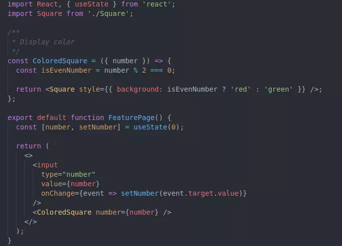
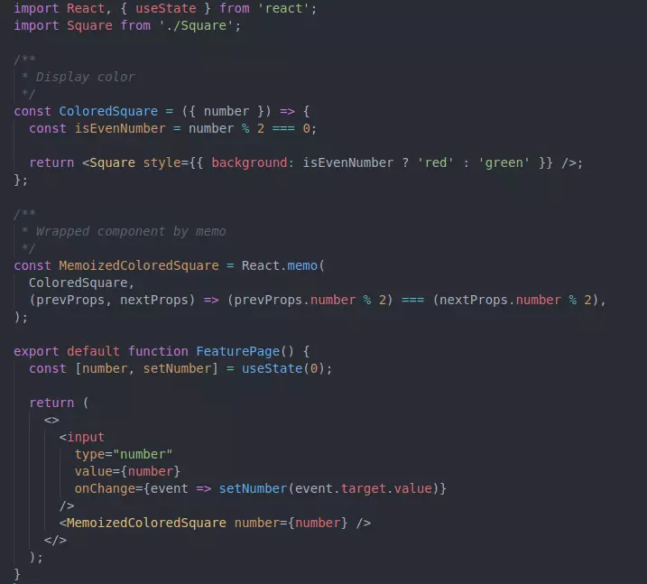
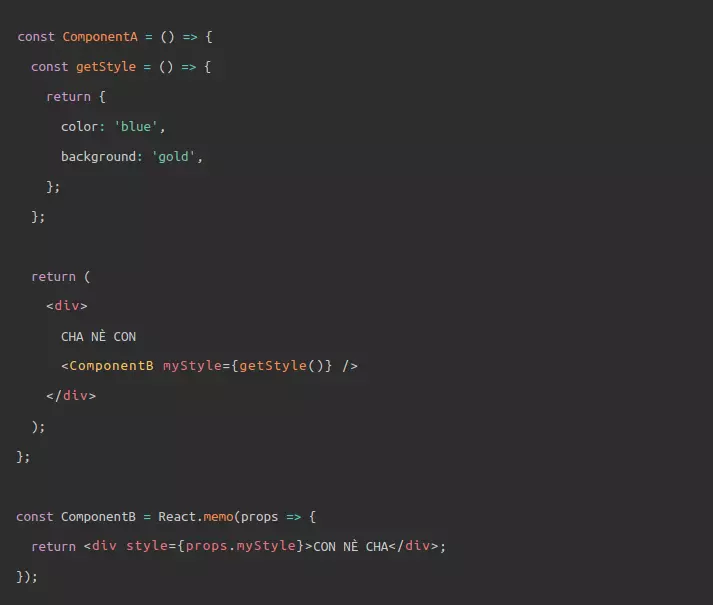
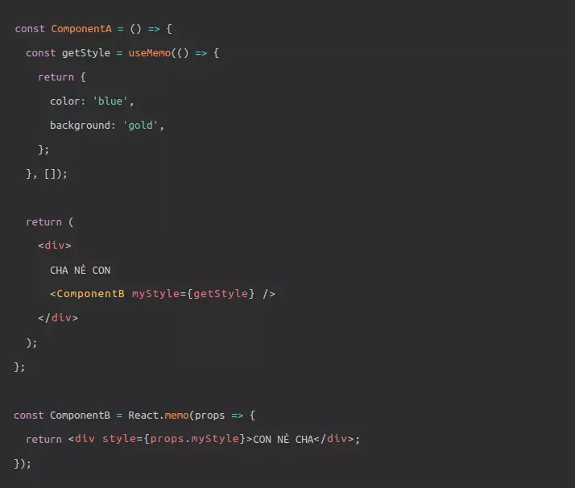
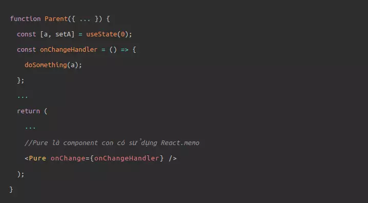
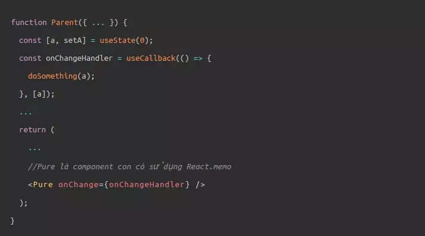
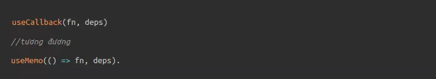
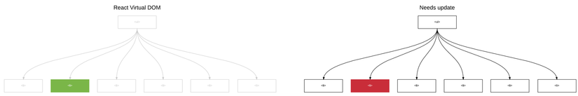

**React Interview**

1.  **[Life cycle]

-   **componentWillMount:** là method được thực thi trước khi 1
    component được render ở cả phía server side và client side.

-   **componentDidMount:** method được thực thi khi 1 component được
    render trên client side. Đây là nơi các AJAX requests, DOM và update
    state được thực thi. Method này cũng được sử dụng để kết nối với các
    JS Framework khác và các function với delayed execution như
    setTimeout or setInterval.

-   **componentWillReceiveProps:** sẽ được thực thi ngay khi thuộc tính
    props được update và trước khi component được render lại.

-   **shouldComponentUpdate:** sẽ trả về kết quả true or false. Phương
    thức này sẽ xác định component có được update hay không. Mặc định là
    giá trị true. Nếu không muốn component render lại sau khi update
    state hay props thì return giá trị thành false.

-   **componentWillUpdate:** được gọi khi update state của component
    trước khi render lại.

-   **componentDidUpdate:** sau khi componentWillUpdate ở trên được gọi
    xong thì gọi đến phương thức này

-   **componentWillUnmount:** được gọi khi muốn unmount 1 component như
    việc xoá nó khỏi react.

=\> Khi nào cần sử dụng các lifecycle thì nên sử dụng class component và
ngược lại sử dụng function component.

=\> Tham chiếu điều này qua useEffect:

-   **useEffect:** được thực thi ngay khi cập nhật DOM, là function giúp
    làm thay đổi bên trong component, useEffect tương đương với
    componentDidMount, componentDidUpdate và componentWillMount.

\+ **useEffect**: khi component cần cập nhật lại sau khi render, nó sẽ
gọi useEffect

\+ **useEffect**: nằm trong component để khi có props pass hay state
trong component update thì sẽ gọi nó và truy cập các biến ấy.

\+ **useEffect** sẽ chạy mỗi khi render. Đó là mặc định

=\> Tối ưu khi cần thiết điều này cũng đại diện cho
**componentDidUpdate:** Ví như việc đặt 1 dependency vào trong \[count\]
như thế này, nó như là tham số thứ 2 của useEffect. Ở lần cập nhật, nó
sẽ so sánh giá trị kế với giá trị trước đó. Nếu giá trị count không thay
đổi sẽ không render lại.

=\> Hay là clean up an effect. Những effect mà có return nhằm để dọn dẹp
những tác vụ không cần thiết khi unmount hoặc dọn dẹp các event không
dùng. Điều này tương tự **componentWillUnmount.**

=\> Đánh giá về **shouldComonentUpdate:** có thể dùng React.memo thay
thế.

=\> Bàn về PureComponent.

2.  **[Khi nào nên sử dụng PureComponent hoặc Component.]{.ul}**

-   Khi props hoặc state thay đổi, PureComponent sẽ là một shallow
    comparision trên cả props và state. Component sẽ không so sánh props
    và state của hiện tại với tương lai. Như vậy, component sẽ re-render
    bởi mặc định bất cứ khi nào shouldComponentUpdate gọi.

-   Không thay đổi object và arrays trong props và state (immutate). Nếu
    thay đổi object trong trong 1 component cha, component pure "con" sẽ
    không update. Mặc dù giá trị thay đổi ở component cha nhưng
    component con sẽ so sánh reference tới props trước đó và không phát
    hiện sự khác biệt (vẫn có giá trị truyền vào), chúng vẫn cùng
    reference tới cùng 1 object.

-   Thay vào đó trả về 1 objects mới khi làm 1 sự thay dổi bằng cách
    object và array spreading hoặc sử dụng thư viện để thực thi
    immutability.

**=\> Optimize Performance**

**A. Đừng bind giá trị vào function trong render hay sử dụng arrow
function.**

VD:

**shouldn't:**

**\<CommentItem likeComment={() =\> this.likeComment(user.id)} /\>**

=\> Vấn đề ở đây là mỗi lần component cha render method sẽ gọi 1
function mới với 1 reference mới được tạo ra truyền xuống likeComment.
Điều này có nghĩa sideEfffect của props thay đổi trên mỗi component con
mà lần lượt sẽ khiến chúng re-render, thậ, chí dữ liệu vẫn giống nhau.

**Should:**

**\<CommentItem likeComment={this.likeComment} userID={user.id} /\>**

=\> Để giải quyết, chỉ cần chuyền function nguyên mẫu từ component cha
tới con. Props của likeComment sẽ luôn có cùng reference và không gây ra
re-render không cần thiết.

**B. Không lấy dữ liệu trong render**

  ----------------------------------------------
  render() {
  const { posts } = this.props
  const topTen = \[\...posts\].sort((a, b) =\>
  b.likes - a.likes).slice(0, 9)
  return //\...
  }
  ----------------------------------------------

**topTen** sẽ có một *new reference* mỗi lần component re-render, mặc
dù **posts** không có sự thay đổi và dữ liệu có cùng nguồn gốc. Điều này
sau đó sẽ re-render list một cách không cần thiết.

=\> giải quyết bằng caching dữ liệu gốc. Đặt dữ liệu gốc trong state của
component và update chỉ khi post có updated.

  ----------------------------------------------------------------------
  componentWillMount() {
  this.setTopTenPosts(this.props.posts)
  }
  componentWillReceiveProps(nextProps) {
  if (this.props.posts !== nextProps.posts) {
  this.setTopTenPosts(nextProps.posts)
  }
  }
  setTopTenPosts(posts) {
  this.setState({
  topTen: \[\...posts\].sort((a, b) =\> b.likes - a.likes).slice(0, 9)
  })
  }
  ----------------------------------------------------------------------

**=\> Vậy khác biệt so với React.Memo là gì ?**

3.  **[React.Memo]{.ul}**

-   React.memo() hoạt động như React.PureComponent (nhưng nó chỉ
    shallowly so sánh props), nó là function component thay vì class như
    PureComponent. React.memo là 1 HOC, được sử dụng để bọc các
    component. Bằng việc sử dụng React.memo(), react sẽ bỏ qua việc
    render lại component và sử dụng kết quả đã render lần cuối cùng nếu
    component của bạn render cùng kết quả với cùng props.

-   VD: Background của component sẽ thay đổi thành đỏ nếu người dùng
    nhập vào một số chẵn, là xanh nếu người dùng nhập vào số lẻ.



Component ColoredSquare sẽ luôn được render lại mỗi khi người dùng đổi
giá ở input, bất kể nó là giá trị gì. Để nâng cao hiệu năng của ứng dụng
thì ta cần xử lý chỉ cho component render lại nếu giá trị đổi từ số chẵn
sang lẻ hoặc lẻ sang chẵn. Ta có thể sử dụng React.memo như sau:



Đối số thức nhất là 1 wrapper component. Đối số thứ hai truyền vào
React.memo sẽ là hàm dùng để React xác định có render lại hay không dựa
trên sự thay đổi của props. Nếu giá trị trả về của hàm là true thì có
nghĩa là React sẽ không render lại component này mà dùng lại kết quả đã
render trước đó và ngược lại nếu trả về giá trị false thì React sẽ
render lại component này.

**=\> Khi nào nên dùng React.memo()**

1.  Trước hết thì component của bạn phải là functional component đã nhé.

2.  Component của bạn thường xuyên bị re-render.

3.  Nếu component của bạn luôn luôn bị re-render mặc dù prop không thay
    đổi.

4.  Component của bạn chứa một lượng lớn tính toán logic và UI như
    Chart, Canvas, 3D library....

VD: MovieViewsRealtime hiển thị số views của một bộ phim, với dữ liệu
cập nhật realtime. Mỗi lần prop views được cập nhật với một con số mới,
MovieViewsRealtime sẽ re-render. Điều này làm cho Movie cũng re-render
theo mặc dù title và releaseDate không thay đổi.Trường hợp này chúng ta
sẽ áp dụng React.memo() để hạn chế việc re-render trên Movie component

=\> **Khi nào tránh sử dụng React.memo()**

1.  Nếu component của bạn không bị re-render mặc dù prop không thay đổi,
    rất có thể bạn không cần React.memo ().

2.  Các thay đổi liên quan đến hiệu suất được áp dụng không chính xác
    thậm chí có thể gây hại cho hiệu suất. Sử dụng React.memo () một
    cách khôn ngoan.

3.  Component của bạn là class component


4.  Component của bạn đã được memo bởi một HOC khác, ví dụ connect() của
    Redux.

=\> React.memo()

4.  **useMemo()**

-   useMemo tập trung vào việc tránh lặp đi lặp lại các logic tính toán
    nặng nề.

-   Cụ thể, nó trả về 1 giá trị là kết quả từ việc thực thi 1 hàm mà ta
    pas vào ứng với tham số thứ nhất.

-   Nếu 1 trong các dependency thay đổi, thi hàm tính toán sẽ được thực
    thi lại, từ đó trả ra giá trị mới. Ngược lại, nếu nhận thấy giá trị
    của các dependencies không thay đổi, thì useMemo trả ra kết quả
    trước đó mà không tính toán lại, từ đó tránh được 1 khối lượng lớn
    công việc, giúp ích cho performance.

-   Từ việc trả về giá trị trước đó khi dependencies không thay đổi,
    cũng sẽ tránh được việc tạo các object không cần thiết, tránh
    re-render.



Viết như thế này, mỗi lần ComponentA re-render, hàm getStyle sẽ tạo ra
một object mới và pass xuống ComponentB, khiến cho ComponentB bị
re-render (mặc dù đã sử dụng React.memo)

=\> khi có useMemo()



Giờ đây, khi dùng useMemo cho hàm getStyle, (để ý getStyle không còn dấu
gọi hàm, useMemo đã thực thi hàm mà chúng ta pass vào rồi, ta chỉ nhận
ra kết quả - một memoized value mà thôi) ở các lần re-render sau của
ComponentA, object style cũ sẽ được trả ra thay vì tạo mới -\>
React.memo ở ComponentB nhận thấy prop nhận vào không có sự thay đổi -\>
không re-render.

5.  **[useCallback()]{.ul}**

-   useCallback thì tập trung giải quyết vấn đề về performance, khi mà
    các callback function được tạo ở functional component cha pass xuống
    component con luôn bị tạo mới, khiến cho con luôn bị re-render.

-   useCallback trả về một function (chính là function bạn pass vào ứng
    với tham số thứ nhất), callback function này sẽ được tạo lại khi một
    trong số các dependencies thay đổi. Nếu dependencies không đổi,
    function trả về sẽ là function trước đó -\> tức là function pass
    xuống component con không bị tạo mới, tương đương không có object
    được tạo mới -\> component con không bị re-render.

**Khi không dùng useCallback**



Viết thế này, mỗi lần component Parent re-render, callback
onChangeHandler sẽ được tạo mới và pass xuống component con Pure. Mặc
cho component có sử dụng React.memo, nó vẫn bị re-rendered.

**Khi dùng useCallback**



Nhờ sử dụng useCallback, giờ đây ở mỗi lần component Parent re-render,
hàm onChangeHanlder sẽ không còn luôn luôn bị tạo mới nữa, mà sẽ chỉ
được tạo mới khi depencency của nó là biến a thay đổi. Function không bị
tạo mới -\> object không bị tạo mới -\> component con nhận vào cũng
không bị re-render. Tuyệt vời!

**useCallback() \<==\> useMemo()**



Như đã nói phía trên, useMemo sẽ thực thi hàm được pass vào và trả ra
kết quả. Nếu khéo léo, return ra function như là một kết quả, thì lúc
này useMemo sẽ có vai trò và tác dụng giống hệt useCallback.

6.  **[Hooks]{.ul}**

**A. useState**

\[count, setCount\] = useState(0);

-   useState là 1 function nhận 0 là giá trị sẽ setState cho biến count
    trong lần render đầu tiên Nó trả về state(ở đây là count), và
    setState(setCount) là function cập nhật state.

-   cách sử dụng : {count} thay vì {this.state.count}

-   update state: setState có thể được gọi trong event của component:
    setCount tương ứng với setState({count: this.state.count+1 })

-   Điểm khác biệt so với setState là nó không thể tự động auto merged
    cập nhật object/array.

  --------------------------------------------
  setState(prevState =\> {
  // Object.assign would also work
  return {\...prevState, \...updatedValues};
  });
  --------------------------------------------

hoặc useReducer có thể dùng cho cả nested object

***=\> Bất đồng bộ và đồng bộ trong State***

Hàm setState là không đồng bộ. Nghĩa là state sẽ không thực sự được cập
nhật sau khi gọi hàm setState và điều này có thể dẫn tới làm tăng 1 vài
cách xử lý nên tránh.


Với bức ảnh trên, khi gọi setState và sau đó chạy console.log state ngay
lập tức. Đáng lẽ biến counter sẽ đổi thành 1, nhưng thực ra nó vẫn là 0.

=\> setState là 1 hàm callback


=\> nó đã hoạt động. Thay vì truyền 1 đối tượng vào setState, chúng ta
sẽ đưa vào 1 hàm. Cách này được dùng khi sử dụng state hiện tại để tạo
state mới.\
setState không đồng bộ, khi tạo giá trị mới, nó sẽ gây lỗi, VD, trong
khi setState đang chạy, một setState khác có thể đã làm thay đổi state.
Truyền vào 1 hàm sẽ đem lại 2 lợi ích. Đầu tiên là cho phép tạo ra 1 bản
sao tính state hiện tại mà sẽ không thể thay đổi. Thức 2 là nó sẽ chuyển
các lời gọi setState vào hàng đợi để chúng có thể chạy theo thứ tự.

**Bất đồng bộ**


**\
**

**Đồng bộ**


Với cách xử lý đầu tiên, cả 2 hàm setState đều trực tiếp sử dụng
this.state.counter và như chúng ta đã đề cập ở trên, this.state.counter
vẫn sẽ là 0 sau khi setState đầu tiên được gọi. Do đó, chúng ta sẽ nhận
kết quả là 1 thay vì 2 bởi vì cả 2 hàm setState đều đang gán counter là
1Với cách xử lý thứ 2, chúng ta truyền vào setState một hàm, điều này sẽ
đảm bảo cả 2 hàm setState chạy theo thứ tự. Và chúng ta sẽ nhận kết quả
là 2.

**B. useRef**

\- ***useRef hook*** là một function trả về một object với thuộc tính
current được khởi tạo thông qua tham số truyền vào. Object được trả về
này có thể mutate và sẽ tồn tại xuyên suốt vòng đời của component.

\- Có 2 lý do chính mà chúng ta sẽ sử dụng **[useRef]{.ul}**: Truy cập
DOM nodes hoặc React elements và lưu giữ một biến có thể mutate.

\- **[ref]{.ul}** là một thuộc tính của một tag hay một element đại diện
cho chính nó. ref cho phép chúng ta truy cập đến DOM node hoặc React
element đã được mount. Trong vanila Javascript, chúng ta làm việc với
DOM elements bằng cách gọi document.getElementById(). Với ref trong
React chúng ta không cần phải làm vậy. Thuộc tính ref sẽ tham chiếu đến
chính xác element cần dùng.

\- Trong state của component: useState hoặc useReducer. Cập nhật biến
state sẽ gây nên re-render component.

\- Trong một ref: Tương đương với các biến instance trong class
component. Việc mutate thuộc tính .current sẽ không gây nên re-render.

\- forwardRef giúp truy cập đến 1 component

+---------------------------------------------------------------+
| import React from \"react\";                                  |
|                                                               |
| const Input = () =\> \<input type=\"text\" style={style} /\>; |
|                                                               |
| export default Input;                                         |
+---------------------------------------------------------------+

+---------------------------------------------------------+
| import React, { useRef, useEffect } from \"react\";     |
|                                                         |
| import Input from \"./Input\";                          |
|                                                         |
| function App() {                                        |
|                                                         |
| const inputRef = useRef(null);                          |
|                                                         |
| useEffect(() =\> {                                      |
|                                                         |
| if (inputRef.current) {                                 |
|                                                         |
| inputRef.current.focus();                               |
|                                                         |
| }                                                       |
|                                                         |
| console.log({ inputRef });                              |
|                                                         |
| // eslint-disable-next-line react-hooks/exhaustive-deps |
|                                                         |
| }, \[\]);                                               |
|                                                         |
| return (                                                |
|                                                         |
| \<div\>                                                 |
|                                                         |
| \<Input ref={inputRef} /\>                              |
|                                                         |
| \</div\>                                                |
|                                                         |
| );                                                      |
|                                                         |
| }                                                       |
|                                                         |
| export default App;                                     |
+---------------------------------------------------------+

**Chúng ta sẽ nhận một thông báo tham chiếu đến Input Component là
null**


Để fix vấn đề này ta dùng forwardRef như một HOC cho Input Component

+----------------------------------------------------------------------+
| import React, { forwardRef } from \"react\";                         |
|                                                                      |
| const Input = (props, ref) =\> \<input ref={ref} type=\"text\"       |
| style={style} /\>;                                                   |
|                                                                      |
| export default forwardRef(Input);                                    |
+----------------------------------------------------------------------+

**Kết quả:**


**C. useReducer**

\- Đây như là một bảng nâng cấp của useStae hỗ trợ để xử lý state mạnh
mẽ hơn. Giúp việc xử lý nested object và update object(useState không
làm được).

\- Ví dụ : ta muốn thêm mới ghi chú, ta thực hiện chức năng thêm mới.
Ban đầu: ta có initState có mảng notes không có note nào cả. Việc
reducer cũng tương tự như cách viết thư viện reducer, nhận vào state và
action để trả về state tương ứng

Syntax: *const \[state, dispatch\] = useReducer(reducer, initState)*

(Dùng như redux)

**D. useContext:**

Đầu tiên phải nói đến React Context. Chúng ta có thể hiểu đơn giản React
context chỉ là state toàn cục cho tất cả component.

React context API cho phép bạn tạo các đối tượng context toàn cục mà có
thể được sử dụng cho bất kỳ component nào bạn tạo. Điều này cho phép bạn
chia sẻ dữ liệu mà không cần phải truyền các props xuống tất cả các
component trung gian trong cây DOM.

Syntax: const value = useContext(MyContext);

Trong cú pháp này: useContext sử dụng context object được tạo ra từ
React.createContext và sẽ trả về giá trị của context đó. Và giá trị
context đó được lấy từ \<MyContext.Provider\> gần nhất. Ví dụ: ta tạo ra
context và provider

+------------------------------------------------------+
| const UserContext = createContext();                 |
|                                                      |
| const UserProvider = (props) =\> {                   |
|                                                      |
| const \[state, setState\] = useState({               |
|                                                      |
| backgroundColor: \"blue\"                            |
|                                                      |
| });                                                  |
|                                                      |
| return (                                             |
|                                                      |
| \<UserContext.Provider value={\[state, setState\]}\> |
|                                                      |
| {props.children}                                     |
|                                                      |
| \</UserContext.Provider\>                            |
|                                                      |
| );                                                   |
|                                                      |
| }                                                    |
|                                                      |
| export {                                             |
|                                                      |
| UserContext,                                         |
|                                                      |
| UserProvider,                                        |
|                                                      |
| }                                                    |
+------------------------------------------------------+

Tương ứng:

+----------------------+
| \<UserProvider\>     |
|                      |
| \<TestUseContext /\> |
|                      |
| \</UserProvider\>    |
+----------------------+

Ta sử dụng context:

+----------------------------------------------------------------------+
| export function TestUseContext() {                                   |
|                                                                      |
| const \[state,setState\] = useContext(UserContext);                  |
|                                                                      |
| return (                                                             |
|                                                                      |
| \<\>                                                                 |
|                                                                      |
| \<p style={{ background: state.backgroundColor}}\>xin chào\</p\>     |
|                                                                      |
| \<input type=\"color\" onClick={(e) =\>                              |
| setState({backgroundColor,e.target.value)}/\>                        |
|                                                                      |
| \</\>                                                                |
|                                                                      |
| )                                                                    |
+----------------------------------------------------------------------+

**E. useImperativeHandle**

\- useImperativeHandle: Component child có thể tuỳ chỉnh các trả về ref
cho component cha. useImperativeHandle phải đi kèm với forwardRef.

\- Để hỗ trợ thêm cho ref, hạn chế dùng trong tất cả các trường hợp.

VD:

**Component con**

+--------------------------------------------------------------------------+
| import React, { useRef, useImperativeHandle, forwardRef} from \'react\'; |
|                                                                          |
| function ChildInput(props, ref) {                                        |
|                                                                          |
| const inputRef = useRef();                                               |
|                                                                          |
| useImperativeHandle(ref, () =\> inputRef.current);                       |
|                                                                          |
| return \<input type=\"text\" ref={inputRef} /\>;                         |
|                                                                          |
| }                                                                        |
|                                                                          |
| export default forwardRef(ChildInput);                                   |
+--------------------------------------------------------------------------+

**Component cha**

+---------------------------------------------------+
| import React, {useEffect, useRef} from \"react\"; |
|                                                   |
| import ChildInput from \"./ChildInput\";          |
|                                                   |
| export function ImperativeHandle () {             |
|                                                   |
| const inputRef = useRef();                        |
|                                                   |
| useEffect(() =\> {                                |
|                                                   |
| inputRef.current.focus();                         |
|                                                   |
| }, \[\]);                                         |
|                                                   |
| return (                                          |
|                                                   |
| \<div\>                                           |
|                                                   |
| \<ChildInput ref={inputRef} /\>                   |
|                                                   |
| \</div\>                                          |
|                                                   |
| );                                                |
|                                                   |
| }                                                 |
+---------------------------------------------------+

7.  **HOC (Higher Order Component)**

Cụ thể, HOC là 1 function mà lấy vào 1 component và trả về 1 component
mới.

Khi 1 component chuyển đổi props sang UI, 1 HOC sẽ chuyển đổi 1
component thành 1 component khác.

HOCs phổ biến trong các thư viện React của bên thứ 3, như là Redux's
connect hay Relay's createFragmentContainer.

+----------------------------------------------------------+
| const CommentListWithSubscription = withSubscription(    |
|                                                          |
| CommentList,                                             |
|                                                          |
| (DataSource) =\> DataSource.getComments()                |
|                                                          |
| );                                                       |
|                                                          |
| const BlogPostWithSubscription = withSubscription(       |
|                                                          |
| BlogPost,                                                |
|                                                          |
| (DataSource, props) =\> DataSource.getBlogPost(props.id) |
|                                                          |
| );                                                       |
+----------------------------------------------------------+

Tham số đầu tiên là wrapped component. Tham số thứ hai truy xuất dữ liệu
mà chúng tôi quan tâm, được cung cấp DataSource và các props hiện tại.

Link chi tiết:
*[https://reactjs.org/docs/higher-order-components.html]{.ul}*

8.  **Redux**

-   Store: giữ các state của ứng dụng

-   Action: Nguồn thông tin của store

-   Reducer: Xác định cách mà state của ứng dụng thay đổi theo các hành
    động được gửi đến store

```{=html}
<!-- -->
```
-   **Cách hoạt động của Redux:**

> Redux đi theo luồng dữ liệu 1 chiều. Điều đó có nghĩa rằng dữ liệu ứng
> dụng của bạn sẽ đi theo luồng dữ liệu one-way binding. Nếu ứng dụng
> phát triển và trở nên phức tạp thì sẽ khó để tái taoh và thêm các tính
> năng mới nếu không kiểm soát được state của ứng dụng.
>
> Redux giảm thiểu độ phức tạp của code, bằng cách thực thi hạn chế về
> cách thức và thời điểm update state có thể xảy ra. Cách này quản lý
> việc đã update state 1 cách dễ dàng. Chúng ta đã biết về các hạn chế
> như ba nguyên tắc của Redux.

-   1 action được dispatch khi user tương tác với ứng dụng

-   Hàm root reducer được gọi với state hiện tại và dispatch action.
    Root reducer có thể chia ra nhiều tác vụ giữa những hàm reducer nhỏ
    mà cuối cùng trả về 1 state mới.

-   Store thông báo tới view bằng cách thực thi hàm callback

-   View có thể lấy lại state đã update và re-render


-   **Cơ chế reselect trong redux**

Trước hết phải hiểu selector là gì ? selector có thể hiểu là một hàm
được sử dụng để tính toán ra 1 giá trị nào đó từ các giá trị có sẵn,
hoặc chỉ đơn giản là lấy 1 giá trị từ 1 giá trị có sẵn

Đây là 1 cách để viết selector mà lấy hoặc tính toán các giá trị trong
store của redux để tái sử dụng chúng trogn function mapStateToProps.

+----------------------------------------------------------------------+
| // selector dùng để lấy property \'users\' từ store của redux        |
|                                                                      |
| const getUsers = state =\> state.users;                              |
|                                                                      |
| // selector dùng để tính toán một giá trị dựa trên property          |
| \'users\' //của store                                                |
|                                                                      |
| const getUserViaId = (state, id) =\> state.users.map(user =\>        |
| user.id === id);                                                     |
+----------------------------------------------------------------------+

Tuy nhiên, mỗi khi khi users được update, hàm getUserViaId và getUser sẽ
phải tính toán lại. Đây chính là vấn đề của các selector đơn giản, khi
users trở nên lớn hơn, hoặc việc tính toán bên trong getUserViaId phức
tạp hơn, tốn nhiều tài nguyên hơn và kết quả là app sẽ chậm hơn.

-   Sử dụng ***Reselect.***

+) Reselect

1 thư viện tạo ra hàm memoized "selector". Được sử dụng phổ biến với
Redux hoặc sử dụng với bất kì dữ liệu JS thuần tuý nào hay được tích hợp
trong Redux Toolkit.

-   Selectors có thể tính toán dữ liệu dẫn xuất, cho phép Redux lưu trữ
    state tối thiểu nhất có thể. VD:

> // Derive the data while rendering\
> const allTodosCompleted = todos.every(todo =\> todo.completed)

-   Selectors hiệu quả. 1 selector không tính toán lại trừ khi 1 trong
    các đối số thay đổi

-   Selectors có thể kết hợp. Chúng có thể được sử dụng làm đầu vào cho
    các bộ chọn khác.

> Reselect export ra 1 createSelector API mà tạo ra hàm memoized
> selector. createSelector chấp nhận 1 hoặc nhiều input selectors mà giá
> trị trích xuất từ đối số, và 1 ouput selector nhận giá trị được trích
> xuất và trả về 1 derived value. Nếu selector được tạo nhiều lần,
> output sẽ chỉ tính toán lại khi giá trị trích xuất thay đổi, còn không
> nó sẽ lấy giá trị được memoized trước đó.

+------------------------------------------------------------------+
| import { createSelector } from \'reselect\'                      |
|                                                                  |
| const selectShopItems = state =\> state.shop.items               |
|                                                                  |
| const selectTaxPercent = state =\> state.shop.taxPercent         |
|                                                                  |
| const selectSubtotal = createSelector(selectShopItems, items =\> |
|                                                                  |
| items.reduce((subtotal, item) =\> subtotal + item.value, 0)      |
|                                                                  |
| )                                                                |
|                                                                  |
| const selectTax = createSelector(                                |
|                                                                  |
| selectSubtotal,                                                  |
|                                                                  |
| selectTaxPercent,                                                |
|                                                                  |
| (subtotal, taxPercent) =\> subtotal \* (taxPercent / 100)        |
|                                                                  |
| )                                                                |
|                                                                  |
| const selectTotal = createSelector(                              |
|                                                                  |
| selectSubtotal,                                                  |
|                                                                  |
| selectTax,                                                       |
|                                                                  |
| (subtotal, tax) =\> ({ total: subtotal + tax })                  |
|                                                                  |
| )                                                                |
|                                                                  |
| const exampleState = {                                           |
|                                                                  |
| shop: {                                                          |
|                                                                  |
| taxPercent: 8,                                                   |
|                                                                  |
| items: \[                                                        |
|                                                                  |
| { name: \'apple\', value: 1.2 },                                 |
|                                                                  |
| { name: \'orange\', value: 0.95 }                                |
|                                                                  |
| \]                                                               |
|                                                                  |
| }                                                                |
|                                                                  |
| }                                                                |
|                                                                  |
| console.log(selectSubtotal(exampleState)) // 2.15                |
|                                                                  |
| console.log(selectTax(exampleState)) // 0.172                    |
|                                                                  |
| console.log(selectTotal(exampleState)) // { total: 2.322 }       |
+------------------------------------------------------------------+

+----------------------------------------------------------------------+
| const selectValue = createSelector(                                  |
|                                                                      |
| state =\> state.values.value1,                                       |
|                                                                      |
| state =\> state.values.value2,                                       |
|                                                                      |
| (value1, value2) =\> value1 + value2                                 |
|                                                                      |
| )                                                                    |
|                                                                      |
| // You can also pass an array of selectors                           |
|                                                                      |
| const selectTotal = createSelector(                                  |
|                                                                      |
| \[state =\> state.values.value1, state =\> state.values.value2\],    |
|                                                                      |
| (value1, value2) =\> value1 + value2                                 |
|                                                                      |
| )                                                                    |
|                                                                      |
| // Selector behavior can be customized                               |
|                                                                      |
| const customizedSelector = createSelector(                           |
|                                                                      |
| state =\> state.a,                                                   |
|                                                                      |
| state =\> state.b,                                                   |
|                                                                      |
| (a, b) =\> a + b,                                                    |
|                                                                      |
| {                                                                    |
|                                                                      |
| // New in 4.1: Pass options through to the built-in                  |
| \`defaultMemoize\` function                                          |
|                                                                      |
| memoizeOptions: {                                                    |
|                                                                      |
| equalityCheck: (a, b) =\> a === b,                                   |
|                                                                      |
| maxSize: 10,                                                         |
|                                                                      |
| resultEqualityCheck: shallowEqual                                    |
|                                                                      |
| }                                                                    |
|                                                                      |
| }                                                                    |
|                                                                      |
| )                                                                    |
+----------------------------------------------------------------------+

> ***Link: <https://github.com/reduxjs/reselect>***

9.  **ReactDOM**

**DOM** giúp thao tác với dữ liệu theo mô hình hướng đối tượng do các
phần tử trong **DOM** có cấu trúc được định nghĩa thành các *đối tượng,
phương thức, thuộc tính* để có thể truy xuất dễ dàng. Chúng được coi như
các *node* và được biểu diễn dưới dạng **DOM Tree**.

Trong khi HTML là 1 đoạn code, **DOM** là một thể hiện trừu tượng của
đoạn code đó trong bộ nhớ.

+-------------------------------------+
| \<html\> -\> document node          |
|                                     |
| \<head\> -\> element node - head    |
|                                     |
| \<title\>                           |
|                                     |
| HTML DOM -\> text node              |
|                                     |
| \</title\> -\> element node - title |
|                                     |
| \</head\>                           |
|                                     |
| \<body\> -\> element node - body    |
|                                     |
| \</body\>                           |
|                                     |
| \</html\>                           |
+-------------------------------------+

**HTML DOM** cung cấp API để duyệt và chỉnh sửa các node. Nó chứa các
phương thứcthức như getElementById hay removeChild.

**DOM** nhanh. Việc cập nhật các node trong **DOM** không mất nhiều thời
gian hơn việc thiết lập một thuộc tính trên một đối tượng JavaScript. Đó
là một hoạt động đơn giản.

Điều chậm ở đây là layout mà các trình duyệt phải làm bất cứ khi nào DOM
thay đổi. Mỗi khi DOM thay đổi, trình duyệt cần phải tính toán lại CSS,
thực hiện dựng lại trang web. Đây là việc cần có thời gian.

Và hiện nay **DOM Tree** thực sự rất lớn. Việc những trang web SPA ngày
càng được phát triển mạnh và đa dạng, vì vậy việc sửa đổi **DOM
Tree** là liên tục không ngừng và sửa đổi rất nhiều.

-   Sinh ra **Virtual DOM**

> Một cách tổng quát thì nó là một định dạng dữ liệu JavaScript nhẹ được
> dùng để thể hiện nội dung của **DOM** tại một thời điểm nhất định nào
> đó. Nó có tất cả các thuộc tính giống như **DOM** nhưng không có khả
> năng tương tác lên màn hình như **DOM**.
>
> Bạn có thể tưởng tượng, ở **DOM** có thẻ div và các thẻ p ở trong,
> ReactJs sử dụng Virtual **DOM** bằng cách tạo ra các object React.div
> và React.p và khi tương tác, ta sẽ tương tác qua các object đó một
> cách nhanh chóng mà không phải đụng tới DOM hay **DOM API** của nó.
>
> **Virtual DOM** sử dụng key, ref mà ở **DOM** không có và **Virtual
> DOM** được tạo mới sau mỗi lần render lại.

React lấy một snapshot của **Virtual DOM** (có thể hiểu là bản ghi trạng
thái ngay lúc đó) ngay trước khi áp dụng bất kỳ bản cập nhật nào. Sau
đó, nó sử dụng snapshot này để so sánh với một **Virtual DOM** được cập
nhật trước khi thực hiện các thay đổi.

Khi cập nhật được cấp cho **Virtual DOM**, quá trình tiếp theo React sử
dụng thuật toán Diffing để so sánh và đối chiếu để biết được sự cập nhật
được diễn ra ở đâu sau đó cập nhật nó mà bỏ qua những elements không
liên quan.



10. **React-Router**

-   React-Router là một thư viện định tuyến (routing) tiêu chuẩn trong
    React. Nó giữ cho giao diện của ứng dụng đồng bộ với URL trên trình
    duyệt. React-Router cho phép bạn định tuyến \"luồng dữ liệu\" (data
    flow) trong ứng dụng của bạn một cách rõ ràng. Nó tương đương với sự
    khẳng định, nếu bạn có URL này, nó sẽ tương đương với Route này, và
    giao diện tương ứng.

a)  ***BrowserRouter and HashRouter***

-   React-Router cung cấp cho chúng 2 thành phần hay sử dụng đó
    là BrowserRouter & HashRouter. Hai thành phần này khác nhau ở
    kiểu URL mà chúng sẽ tạo ra và đồng bộ.

-   BrowserRouter: Được sử dụng phổ biến hơn, nó sử dụng History API có
    trong HTML5 để theo dõi lịch sử bộ định tuyến của bạn.

-   HashRouter: Sử dụng hash của URL (window.location.hash) để ghi nhớ
    mọi thứ

b)  ***Route***

-   Route: Định nghĩa một ánh xạ (mapping) giữa một URL và
    một Component. Điều đó có nghĩa là khi người dùng truy cập theo một
    URL trên trình duyệt, một Component tương ứng sẽ được render trên
    giao diện.

\<Router\>

\<div className=\"App\"\>

\<Route path=\"/\" exact component={Home} /\>

\<Route path=\"/about\" component={About} /\>

\<Route path=\"/contact\" component={Contact} /\>

\<Route component={NotFound}/\>

\</div\>

\</Router\>

-   **path:** Là đường dẫn trên URL.

-   **exact:** Liúp cho route này này chỉ hoạt động nếu URL trên trình
    duyệt phù hợp tuyệt đối với giá trị của thuộc tính path của nó.

-   **component:** Là component sẽ đươc load ra tương ứng với Route đó.

c)  Link

Trong HTML thì cặp thẻ để chuyển hướng đó là thẻ \<a\>\</a\> thì trong
react chúng ta sẽ dử dụng cặp
thẻ \<Link\>\</Link\> được import từ React-Router.

\<Link to=\"/about\"\>About\</Link\>

trong đó:

-   **to**: Giống như thuộc tính href trong thẻ a.
